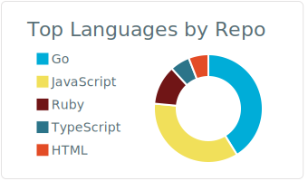
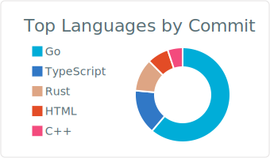
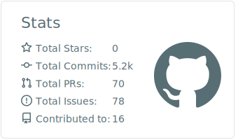

# Zenn Articles

<!-- profile updater begin: zenn -->
- Feb 19 [【Go】春分の日と秋分の日をロジックで算出する](https://zenn.dev/kumackey/articles/d20220219-21c9a5e8b8603a)
- Jan 22 [リリースフラグによってプルリクを小さくする方法](https://zenn.dev/kumackey/articles/d20220120-98f77cad115deb)
- Oct 23 [【Go】Developer eXperience Day 2021における和田さんのテスト駆動開発の解説をGoで実装してみた](https://zenn.dev/kumackey/articles/a9dc6ab95780d0)
- Oct 17 [【PHP入門】json_encodeで明示的に配列・オブジェクトにエンコードさせる](https://zenn.dev/kumackey/articles/06b87040c5374d)
- Sep 26 [【入門】結局getter/setterは悪なのか](https://zenn.dev/kumackey/articles/c3acbd928d1d510268ab)
<!-- profile updater end: zenn -->

# Qiita Articles

<!-- profile updater begin: qiita -->
- Feb 16 [【個人開発】Githubのプロフィールに、Qiita・Zennの記事などを一覧表示させる、Github Actionsのアクション作ったよ！](https://qiita.com/kumackey/items/5bf3dec679f6888d9d4b)
- Jan 24 [【PHP】住所を都道府県/市区町村/それ以降に分ける](https://qiita.com/kumackey/items/caa6d4f5eb3370ef59f4)
- Dec 30 [【PHP】DatetimeImmutableのコンストラクタはタイムゾーン判定において文字列を優先する](https://qiita.com/kumackey/items/e49aeb89f5eced4cdbfa)
- Nov 20 [【PHP入門】RubyエンジニアがPHPを勉強し始めるときに見る記事](https://qiita.com/kumackey/items/352ce983362d186773be)
- Aug 29 [「確定する」の命名](https://qiita.com/kumackey/items/e1d30002104a016ba1fe)
<!-- profile updater end: qiita -->

# connpass Events

<!-- profile updater begin: connpass -->
- Feb 22 [【画面キャプチャ禁止】うちの管理画面フロントエンドほぼ全部見せます！](https://caddi.connpass.com/event/239169/)
- Feb 11 [ゴリラ.Go #2](https://gorilla-go.connpass.com/event/237637/)
- Feb 9 [実践！インテグレーションパターン](https://modeling-how-to-learn.connpass.com/event/233934/)
- Feb 7 [AWSの基礎を学ぼう 第七十一回](https://awsbasics.connpass.com/event/236239/)
- Feb 5 [特別編 Amazon VPC IP Address Manager ハンズオン](https://awsbasics.connpass.com/event/235160/)
<!-- profile updater end: connpass -->
